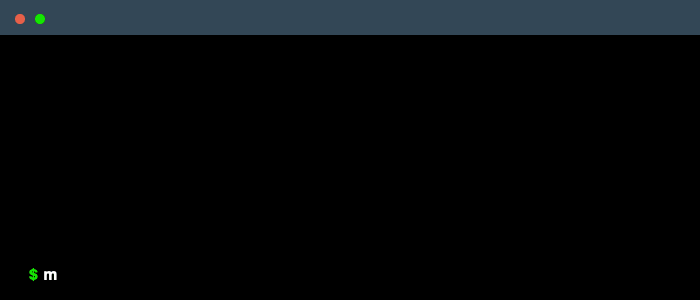

# Marsha AI Language

[](https://discord.gg/p5BTaWAdjm)
[](https://github.com/alantech/marsha)

<p align="center"><b>Describe Logic ⴲ Provide Examples ⴲ Run Reliably</b><br /><br /></p>

Marsha is an LLM-based programming language. Describe what you want done with a simple syntax, provide examples of usage, and the Marsha compiler will guide an LLM to produce tested Python software.

## Usage

The Marsha compiler can be used to compile the syntax using a `pip` module via a terminal or Jupyter Notebook:

```bash
pip install git+https://github.com/alantech/marsha
python -m marsha data_mangling.mrsh
```

## Syntax

The Marsha syntax looks a lot like markdown and is a mixture of English and mathematical notation. It has its own file format `.mrsh` that houses function definition(s). The syntax is subject to change as Marsha is currently in an alpha state. If you have a legitimate use case for Marsha, please let us know.

### Data Types

Data types provide function type safety which helps improve the accuracy of the code generation. The data type format is almost identical to the CSV format.

```md
# type EmployeeSkills
name, skill
Bob,	math
Jake,	spreadsheets
Lisa,	coding
Sue,	spreadsheets
```

It is also possible for Marsha to infer the data type from CSV file

```md
# type EmployeesByDepartment employees_by_department.csv
```

### Functions

Functions are the bread and butter of Marsha and can easily define transformations between different data types. There are three sections to a Marsha function: the declaration, the description, and the examples.

The declaration is a Markdown heading section prefixed with `func`, then followed by a name, parenthesis containing the input type(s), and finally a colon followed by the output type. The name must be a single word, but the types don't need to be classic software types, or even the explicit data types defined above. They can themselves be simple descriptions of what the type is meant to be. Eg,

```md
# func get_employee_skills(list of EmployeesByDepartment, list of DepartmentSkills): list of EmployeeSkills
```

The next section is the description of the function. Here you explain what the function should do. Being more explicit here will reduce variability in the generated output and improve reliability in behavior, but it's up to you just how explicit you will be and how much you leave to the LLM to figure out. This is similar to declarative languages like SQL and HTML where there are defaults for things you do not specify, like the sort order of `select` statements or the default styling of a `<div>`. Eg,

```md
This function receives a list of EmployeesByDepartment and a list of DepartmentSkills. The function should be able to create a response of EmployeeSkills merging the 2 list by department. Use the pandas library.
```

The final section is the example section. Here you provide examples of calling the function and what its output should be. Marsha uses this to provide more information to the LLM to generate the logic you want, but also uses it to generate a test suite to validate that what it has generated actually does what you want it to. This feedback loop makes Marsha more reliable than directly using the LLM itself. In some ways, this is similar to Constraint-based programming languages where you validate and verify the behavior of your function in the definition of the function itself, but it is also less stringent than those, allowing incomplete constraints where constraint-based languages will fail to compile in the face of that ambiguity. Eg,

```md
* get_employee_skills() = throws an error
* get_employee_skills([EmployeesByDepartment('Joe', 'Accounting')]) = throws an error
* get_employee_skills([], []) = []
* get_employee_skills([EmployeesByDepartment('Joe', 'Accounting')], []) = []
* get_employee_skills([], [DepartmentSkills('Accounting', 'math')]) = []
* get_employee_skills([EmployeesByDepartment('Joe', 'Accounting')], [DepartmentSkills('Accounting', 'math')]) = [EmployeeSkills('Joe', 'math')]
* get_employee_skills([EmployeesByDepartment('Joe', 'Accounting'), EmployeesByDepartment('Jake', 'Engineering')], [DepartmentSkills('Accounting', 'math')]) = [EmployeeSkills('Joe', 'math')]
* get_employee_skills([EmployeesByDepartment('Joe', 'Accounting'), EmployeesByDepartment('Jake', 'Engineering')], [DepartmentSkills('Accounting', 'math'), DepartmentSkills('Engineering', 'coding')]) = [EmployeeSkills('Joe', 'math'), EmployeeSkills('Jake', 'coding')]
```

Altogether this produces:

```md
# func get_employee_skills(list of EmployeesByDepartment, list of DepartmentSkills): list of EmployeeSkills

This function receives a list of EmployeesByDepartment and a list of DepartmentSkills. The function should be able to create a response of EmployeeSkills merging the 2 list by department. Use the pandas library.

* get_employee_skills() = throws an error
* get_employee_skills([EmployeesByDepartment('Joe', 'Accounting')]) = throws an error
* get_employee_skills([], []) = []
* get_employee_skills([EmployeesByDepartment('Joe', 'Accounting')], []) = []
* get_employee_skills([], [DepartmentSkills('Accounting', 'math')]) = []
* get_employee_skills([EmployeesByDepartment('Joe', 'Accounting')], [DepartmentSkills('Accounting', 'math')]) = [EmployeeSkills('Joe', 'math')]
* get_employee_skills([EmployeesByDepartment('Joe', 'Accounting'), EmployeesByDepartment('Jake', 'Engineering')], [DepartmentSkills('Accounting', 'math')]) = [EmployeeSkills('Joe', 'math')]
* get_employee_skills([EmployeesByDepartment('Joe', 'Accounting'), EmployeesByDepartment('Jake', 'Engineering')], [DepartmentSkills('Accounting', 'math'), DepartmentSkills('Engineering', 'coding')]) = [EmployeeSkills('Joe', 'math'), EmployeeSkills('Jake', 'coding')]
```

### Goals

The Marsha syntax is meant to be:
- minimal and "obvious", but also discourage lax or incomplete information that could lead to unpredictable behavior
- be mechanically parseable for syntax highlighting and quick feedback on correctness issues to the user
- make it easy to define examples to reduce the probability of generating faulty code and allow generating tests that the application code can be tested against

## Compiler

Marsha is compiled by an LLM into tested software that meets the requirements described, but implementation details can vary greatly across runs much like if different developers implemented it for you. There is typically more than one way to write software that fulfills a set of requirements. However, the compiler is best-effort and sometimes it will fail to generate the described program. We aim for 80%+ accuracy on our [examples](./examples/). In general, the more detailed the description and the more examples are provided the more likely the output will work. There are also a few flags on how to use Marsha:

```sh
$ marsha --help
usage: marsha [-h] [-d] [-q] [-a ATTEMPTS] [-n N_PARALLEL_EXECUTIONS] [--exclude-main-helper] [-s] source

Marsha AI Compiler

positional arguments:
  source

options:
  -h, --help            show this help message and exit
  -d, --debug           Turn on debug logging
  -q, --quick-and-dirty
                        Code generation with no correction stages run
  -a ATTEMPTS, --attempts ATTEMPTS
  -n N_PARALLEL_EXECUTIONS, --n-parallel-executions N_PARALLEL_EXECUTIONS
  --exclude-main-helper
                        Skips addition of helper code for running as a script
  -s, --stats           Save stats and write them to a file
```

* `-d` adds a significant amount of debug information to the screen. Probably not useful if you're not working on Marsha itself.
* `-q` runs only the initial code generation phase without any of the corrective feedback stages. This is significantly cheaper, but more likely to generate code that doesn't quite work. This could be useful if you're using Marsha like Github Copilot or directly asking for code from ChatGPT, but with the Marsha syntax providing some more structure to produce a better result than you might if simply given a blank screen to write into.
* `-a` The number of times marsha should attempt to compile your program, defaulting to just once. If set to more than 1, on a failure it will try again. For some trickier programs this might improve the ability to get working code at the cost of more LLM calls.
* `-n` The number of parallel LLM threads of "thought" to pursue per attempt. This defaults to 3. When a path succeeds, all of the other paths are cancelled.
* `-s` Save the stats that are printed by default to a file, instead. Probably not useful if you're not working on Marsha itself.
* `--exclude-main-helper` Turns off the automatically generated code to make using your compiled Marsha code from the CLI easier, which is included by default.

## Using compiled Marsha code

By default, Marsha appends logic to the generated Python code to make usage simpler, allowing you to invoke it from the CLI and potentially start a REST server.

```sh
$ python -m duckduckgo --help
usage: duckduckgo.py [-h] [-c {BeautifulSoup,duckduckgo}] [-j] [-t] [-i] [-f INFILE] [-o OUTFILE] [-s SERVE] [params ...]

Marsha-generated CLI options

positional arguments:
  params                Arguments to be provided to the function being run. Optimistically converted to simple python types by default, and left as strings if not possible

options:
  -h, --help            show this help message and exit
  -c {BeautifulSoup,duckduckgo}, --func {BeautifulSoup,duckduckgo}
                        Specifies the function to call. Defaults to the last defined function
  -j, --force-json      Forces arguments, files, or stdin to be parsed as JSON
  -t, --force-text      Forces arguments, files, or stdin to be parsed as raw text
  -i, --stdin           Ignores CLI parameters in favor of stdin (as a single parameter)
  -f INFILE, --infile INFILE
                        Ignores CLI parameters in favor of reading the specified file (as a single parameter)
  -o OUTFILE, --outfile OUTFILE
                        Saves the result to a file instead of stdout
  -s SERVE, --serve SERVE
                        Spins up a simple REST web server on the specified port. When used all other options are ignored
```

* `-c` Lets you choose which function within the generated code you wish to invoke. By default it selects the *last* function defined, as that is usually a "main-like" function.
* `params` are all non-option arguments provided, in order, to the function you are invoking.
* `-j` and `-t` let you choose if the param(s) provided will be parsed as JSON or kept as plain text. By default it will opportunistically parse the arguments but if it fails will keep it as text
* `-i`, `-f`, and `-o` let you choose how input and output is managed. By default inputs are the `params` arguments and the output is to `stdout`, but you can use `-i` to then ignore all `params` and treat `stdin` as the singular input param for your function. Similarly `-f` will do the same, but for the file you specify, and `-o` will write the result to a file you specify instead of to `stdout`.
* `-s` Is a flag to instead run a simple REST server. Using this flag causes it to ignore all other flags. The various function names become `/func_name` endpoints that you can POST to and get a response body back. If you set the `Content-Type` header to `application/json` the input and output will be JSON, if not it will be plain text. If your function takes mutliple arguments, it *must* be called in JSON mode with the arguments each being an element of a top-level array.

## Roadmap

- Improve average accuracy for our test bed above 90%
- Support for visualizations and data storage (geek mode: handle side-effect logic better in general)
- Syntax highlighting (vim, vscode, etc)
- Support for different types of LLM
- Bootstrap the Marsha compiler with a Marsha program
- More target languages other than Python
- A module system
- Edits to Marsha mutating existing Python code instead of regenerating
- "Decompiler" from source code into Marsha syntax
- "Debugger" meta mode to take existing Marsha definition and an example of an unexpected failure and recommend what to update with the Marsha definition.
- Optmization "levels" (spend more time on more iterations with the LLM improving performance, security, etc)
- Marsha GUI mode: visual editor baked into the compiler (eventually with the decompiler/debugger/etc features), and able to generate a GUI wrapper for generated code, enabling end-to-end non-terminal usage
- Better support for a mixed environment (Marsha functions can be used by Python, but how to get Marsha to use hand-written Python functions)
- Better "web scraping" behavior (LLM likes to assume the internet still looks like it did in November 2021, but HTML structure has often changed for the largest websites; automatically correcting that assumption would be nice)