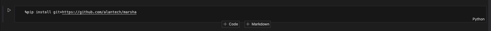
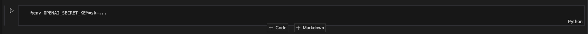
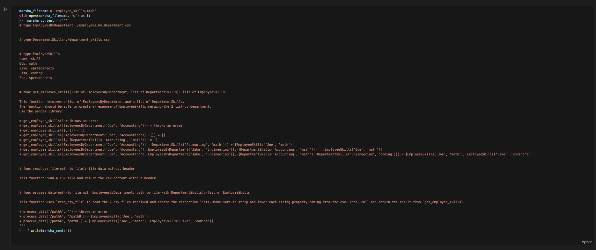
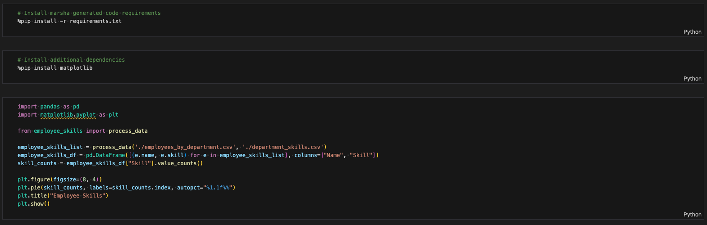

# Marsha + Jupyter Notebook

- Install marsha via pip

- Set OpenAI API key

- Create the `.mrsh` file with the desired definition. In this case, we show how can be defined inline and then saved into a file.

This file is defining a couple of types from the data coming from CSV files, and another type with inline definition, following the CSV format. These `type`s will be translated as classes in the Python generated code.

Then it is defining a set of functions trying to follow the single responsibility principle. The functions are reading a couple of CSV files, doing some data manipulation and returning the final result.

- Execute `marsha`

Marsha generates a Python script, the respective test file for the Python Script and the required dependencies.

- Now there are two options. One is running the file directly [using the compiled marsha code](https://github.com/alantech/marsha#using-compiled-marsha-code). The other option is to just import it into the workflow.

First, it needs to install the needed requirements, and it can just be imported and used inside another Python script. In this case, it is creating a visualization with `matplotlib` for the result obtained.

> The complete notebook example can be found [here](https://github.com/alantech/marsha/tree/main/examples/data-oriented/notebook)
